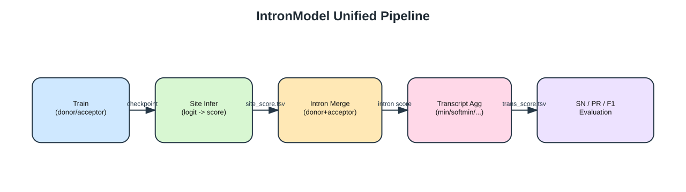
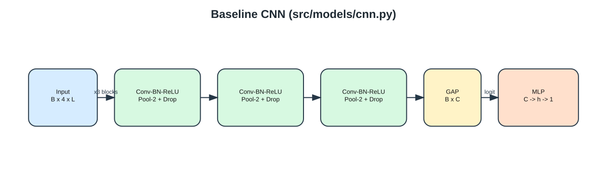
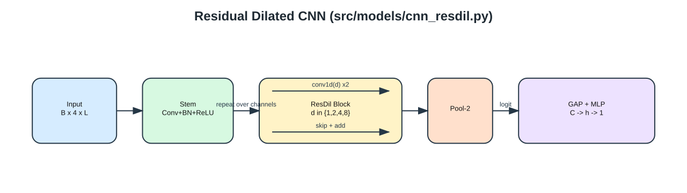
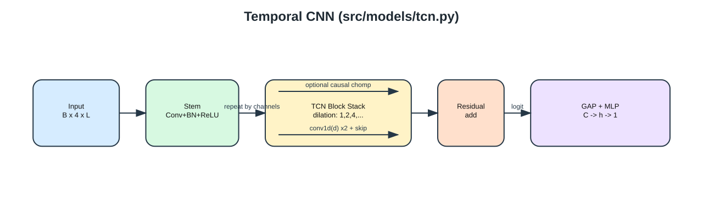
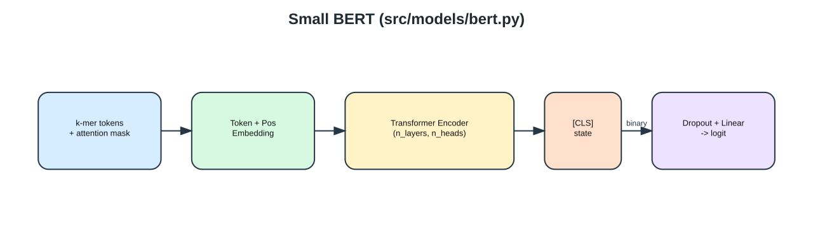
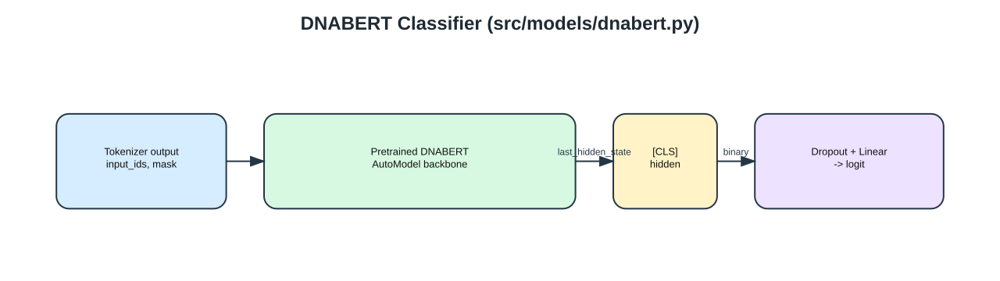
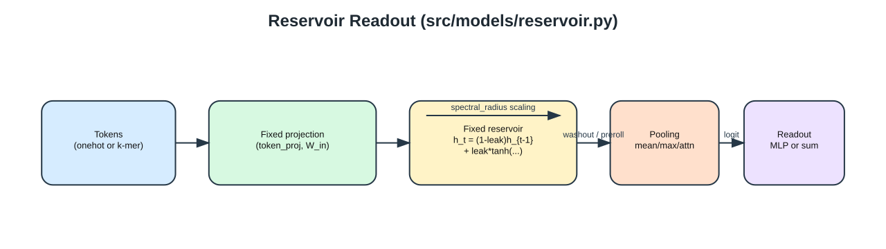
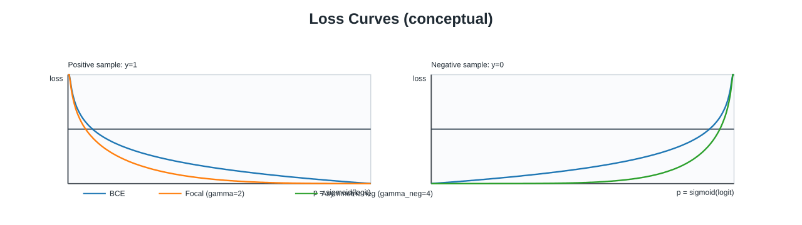
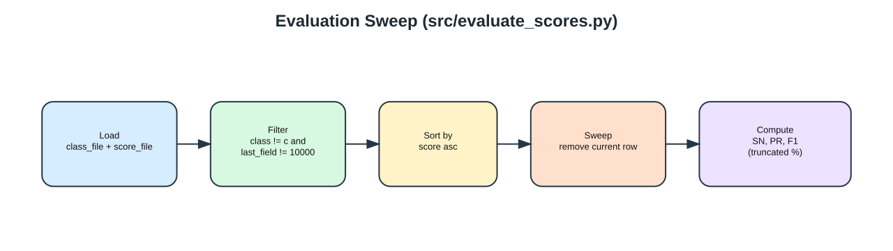
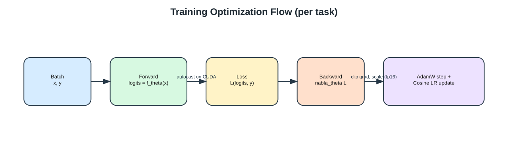

# Model Architecture and Mathematics

This page documents the current implementation in:

- `src/models/cnn.py`
- `src/models/cnn_common.py`
- `src/models/cnn_pair.py`
- `src/models/cnn_resdil.py`
- `src/models/tcn.py`
- `src/models/bert.py`
- `src/models/dnabert.py`
- `src/models/reservoir.py`
- `src/util/sequence_transform.py`
- `src/util/losses.py`
- `src/util/transcript_eval.py`
- `src/evaluate_scores.py`

## 1. End-to-End Pipeline

The unified entrypoint `src/run_model.py` runs:

1. train task models (donor/acceptor independent or pair)
2. infer site-level scores
3. aggregate site scores into transcript scores
4. evaluate SN/PR/F1

## 2. Input Representation

### 2.1 CNN-family (`cnn`, `cnn_resdil`, `tcn`)

Given window length $L$, bases are one-hot encoded:

$$
X \in \{0,1\}^{4 \times L}
$$

with channel order (`A,C,G,T`). Unknown bases are all-zero columns.

Batch shape:

$$
X_{batch} \in \mathbb{R}^{B \times 4 \times L}
$$

Optional sequence transforms (`cnn`, `cnn_pair`):

- `none`: no masking (default)
- `mask_outside_intron_n`: replace outside-boundary region with `N`
  using `intron_half_length + 3bp` boundary-local keep span
- `cnn_v2` tuning wrappers expose the same behavior as a binary `mask`
  hparam: `off` maps to `none`, `on` maps to `mask_outside_intron_n`
- `truncate_outside_intron` is still implemented in
  `src/util/sequence_transform.py`, but it is not part of the `cnn_v2`
  binary mask search space

### 2.2 Transformer-family (`bert`, `dnabert*`)

For k-mer size $k$ (small BERT path), sequence length $L$ yields:

$$
T = \max(0, L-k+1)
$$

Token layout:

$$
[\text{CLS}] + t_1,\dots,t_T + [\text{SEP}]
$$

Then truncate/pad to `max_tokens`.

Batch shapes:

- `input_ids`: $(B, T)$
- `attention_mask`: $(B, T)$

### 2.3 Reservoir input modes (`reservoir`)

Reservoir supports two tokenization modes:

- `onehot`: per-base token stream
- `kmer`: overlapping k-mer token stream

Both modes produce a time-series tensor:

$$
X \in \mathbb{R}^{B \times T \times V}
$$

where $V$ is base- or k-mer feature size. If `input_dim` is smaller than $V$,
the implementation applies a fixed random projection before recurrence.

## 3. CNN Baseline (`src/models/cnn.py`)

Default `conv_channels=[64,128,256]` creates $M$ repeated blocks:

$$
H^{(m)} = \mathrm{Dropout}\left(
\mathcal{P}\left(\mathrm{ReLU}(\mathrm{BN}(\mathrm{Conv1D}(H^{(m-1)})))\right)
\right)
$$

with $H^{(0)} = X$.

Kernel size is configured per stage by `kernel_sizes` (comma-separated list).
If only one value is given, it is broadcast to all stages.
`max_pool_size=2` uses $\mathcal{P}=\mathrm{MaxPool}_2`. More generally,
`max_pool_size=k` uses $\mathcal{P}=\mathrm{MaxPool}_k$, while
`max_pool_size=1` skips the pooling step and keeps only dropout after each
block. `conv_stride=s` applies the same Conv1D stride to every stage.

Readout + head:

$$
z = \mathrm{Readout}(H^{(M)}) \in \mathbb{R}^{B \times C_M}
$$

`head_type=gap` uses global average pooling. `head_type=center` takes the
center position after the conv stack (averaging the two middle positions when
the feature length is even).

$$
\ell = W_2\,\mathrm{Dropout}(\mathrm{ReLU}(W_1z+b_1))+b_2
$$

$$
p = \sigma(\ell)
$$

### 3.1 CNN Pair (`src/models/cnn_pair.py`)

Donor and acceptor are encoded independently up to the configured CNN readout:

$$
z_d = \mathrm{Readout}(f_d(X_d)),\quad z_a = \mathrm{Readout}(f_a(X_a))
$$

Then features are concatenated and scored by one shared MLP:

$$
\ell_{pair} = g([z_d;z_a]),\quad p_{pair}=\sigma(\ell_{pair})
$$

This produces one score per donor/acceptor intron pair.
The pair model uses the same per-block pooling-width control
(`max_pool_size>=1`), shared convolution stride (`conv_stride>=1`), and
`head_type=gap|center` readout inside donor/acceptor encoders and fused CNN
paths.

## 4. Residual Dilated CNN (`src/models/cnn_resdil.py`)

Block equations:

$$
U = \mathrm{ReLU}(\mathrm{BN}_1(\mathrm{Conv1D}_d(X)))
$$

$$
V = \mathrm{Dropout}(\mathrm{BN}_2(\mathrm{Conv1D}_d(U)))
$$

$$
S = \begin{cases}
X & (C_{in}=C_{out}) \\
\mathrm{BN}_{proj}(\mathrm{Conv1D}_{1\times1}(X)) & \text{otherwise}
\end{cases}
$$

$$
Y = \mathrm{ReLU}(V+S)
$$

Dilation cycles as $(1,2,4,8,\dots)$ across blocks.

## 5. Temporal CNN (`src/models/tcn.py`)

The TCN block uses dilated residual convolutions similar to ResDil-CNN, but
without pooling between blocks and with optional causal mode.

Non-causal padding uses symmetric dilation padding. Causal mode pads on the
right and then trims future frames (`chomp`) so output at time $t$ depends only
on times $\le t$.

For one block with dilation $d$:

$$
U = \mathrm{ReLU}(\mathrm{BN}_1(\mathrm{Conv1D}_d(X)))
$$

$$
V = \mathrm{Dropout}(\mathrm{BN}_2(\mathrm{Conv1D}_d(U)))
$$

$$
Y = \mathrm{ReLU}(V + S)
$$

where $S$ is identity or $1\times1$ projection.

The dilation schedule doubles across blocks until a cap:

$$
d \leftarrow \min(2d, 16384)
$$

Then `GAP + MLP` produces logits.

## 6. Small BERT (`src/models/bert.py`)

Embedding:

$$
E = E_{token}(x) + E_{pos}
$$

Self-attention in one head:

$$
\mathrm{Attention}(Q,K,V)=\mathrm{softmax}\left(\frac{QK^\top}{\sqrt{d_k}}\right)V
$$

Classifier uses `[CLS]`:

$$
\ell = W\,\mathrm{Dropout}(H_{[:,0,:]})+b
$$

## 7. DNABERT Classifier (`src/models/dnabert.py`)

Registry keys:

- `dnabert`
- `dnabert2`
- `dnabert6`

`dnabert2` and `dnabert6` are aliases routed to `src/models/dnabert.py`, with
model-specific pretrained checkpoints chosen from wrapper config.

Tokenizer preprocessing is auto-resolved from tokenizer vocabulary:

- variable-length vocab (DNABERT-2/BPE) -> raw DNA sequence input
- fixed-length complete DNA k-mer vocab (for example, 6-mer) -> overlapping
  k-mer text input

Backbone hidden states $H$ from AutoModel are classified via `[CLS]`:

$$
\ell = W\,\mathrm{Dropout}(H_{[:,0,:]})+b
$$

## 8. Reservoir Readout Model (`src/models/reservoir.py`)

Core dynamics (Echo State style):

$$
\tilde h_t = \tanh(W_{in}u_t + W_{res}h_{t-1})
$$

$$
h_t = (1-\lambda)h_{t-1} + \lambda\tilde h_t
$$

where:

- $u_t$ is one-hot or k-mer input (optionally fixed-projected),
- $W_{res}$ is sparse random recurrent matrix scaled to target spectral radius,
- $\lambda$ is leak rate.

`washout` removes early transient steps from state sequences.

Representation and readout options:

- `mts_rep`: `last`, `mean`, `output`, `reservoir`
- optional dim-reduction: `none`, `pca`, `tenpca`
- readout: `lin`, `mlp`, `svm`

Reservoir states are computed in float32 and readout fitting is done with
scikit-learn.

Memory pressure is dominated by the state tensor:

$$
\text{state bytes} \approx N \cdot T \cdot D_{res} \cdot 4
$$

where `4` is bytes per float32 element.

## 9. Loss Functions (`src/util/losses.py`)

For labels $y \in \{0,1\}$ and logits $\ell$:

$$
p=\sigma(\ell),\quad p_t=yp+(1-y)(1-p)
$$

$$
\alpha_t=y\alpha_{pos}+(1-y)(1-\alpha_{pos})
$$

### 9.1 BCE

$$
\mathcal{L}_{BCE}=-\left[y\log p + (1-y)\log(1-p)\right]
$$

### 9.2 Weighted BCE

$$
w_{pos}=\min\left(\frac{N_{neg}}{\max(1,N_{pos})},\text{pos\_weight\_cap}\right)
$$

and `BCEWithLogitsLoss(pos_weight=w_pos)`.

### 9.3 Focal

$$
\mathcal{L}_{focal}=-\alpha_t(1-p_t)^\gamma\log(p_t)
$$

### 9.4 Asymmetric focal

$$
\gamma_t=\gamma_{pos}y+\gamma_{neg}(1-y)
$$

$$
\mathcal{L}_{asym}=-\alpha_t(1-p_t)^{\gamma_t}\log(p_t)
$$

## 10. Transcript Score Aggregation (`src/util/transcript_eval.py`)

For intron $i$ with donor score $d_i$ and acceptor score $a_i$:

- `+`: $s_i=d_i+a_i$
- `*`: $s_i=d_ia_i$
- `harmonic`: $s_i=2d_ia_i/(d_i+a_i)$ (0 if denominator is 0)
- `min`: $s_i=\min(d_i,a_i)$

Transcript aggregation over $\{s_i\}_{i=1}^n$:

- `min`, `max`, `median`, `mean/avg`, `+`, `*`
- `softmin`: $\sum_i \exp(-s_i/\tau)$
- `softmin_wavg`: weighted average by $\exp(-s_i/\tau)$

with $\tau>0$.

Pair model compatibility:

- Pair site scores are aggregated directly per intron.
- Output TSV keeps the same 5-column schema as independent models.
- `Score_donor` and `Score_acceptor` are both filled with the pair score.

## 11. Evaluation Sweep (`src/evaluate_scores.py`)

Sorted transcript scores are swept from low to high by removing current rows
from the retained set.

Let:

- `good`: retained rows with class `=`
- `total`: retained rows with class not equal to `c`
- `ref`: reference count from GFF exon-run parsing

$$
SN=\left\lfloor10000\cdot\frac{good}{ref}\right\rfloor/100
$$

$$
PR=\left\lfloor10000\cdot\frac{good}{total}\right\rfloor/100
$$

$$
F1=\frac{2\cdot SN\cdot PR}{SN+PR}
$$

## 12. Training Optimization and Continue Learning

The neural training-loop family (`cnn`, `cnn_resdil`, `tcn`, `bert`, `dnabert`)
shares:

- AdamW optimizer
- cosine annealing scheduler
- optional AMP (CUDA)
- optional grad clipping
- best-checkpoint tracking by validation metric priority

### 12.1 AdamW + cosine LR

$$
m_t=\beta_1m_{t-1}+(1-\beta_1)g_t,
\quad
v_t=\beta_2v_{t-1}+(1-\beta_2)g_t^2
$$

$$
\theta_t=\theta_{t-1}-\eta_t\left(\frac{\hat m_t}{\sqrt{\hat v_t}+\epsilon}
+\lambda\theta_{t-1}\right)
$$

$$
\eta_t=\eta_{min}+\frac{1}{2}(\eta_0-\eta_{min})
\left(1+\cos\left(\pi t/T_{max}\right)\right)
$$

with $\eta_{min}=\eta_0\cdot\text{eta\_min\_ratio}$.

### 12.2 Continue training semantics

`run_model.py --continue_train` verifies that checkpoints for the current run
name exist, then sets `donor_init_checkpoint_path` and
`acceptor_init_checkpoint_path`.

Current implementation note:

- `dnabert` consumes these init checkpoints explicitly.
- Other model modules currently expose the flag through wrappers, but do not yet
  load init checkpoints inside `train_task_model`.

For all models, `--continue_train` is invalid with `--skip_train`.

### 12.3 Reservoir training semantics

- `reservoir` uses a single-fit RC path (`model.fit`) instead of AdamW epochs.
- Wrapper compatibility flags for AMP/compile are accepted, but not used by the
  RC fit path.
- `--continue_train` is accepted by wrappers, but current RC training refits
  from data.

## 13. Model-by-Model Tensor Shape Reference

| Model | Input | Core latent shape | Logit output |
| --- | --- | --- | --- |
| `cnn` | $(B, 4, L)$ | $(B, C_M)$ after `gap` or `center` readout | $(B,)$ |
| `cnn_resdil` | $(B, 4, L)$ | $(B, C_M)$ after GAP | $(B,)$ |
| `tcn` | $(B, 4, L)$ | $(B, C_M)$ after GAP | $(B,)$ |
| `bert` | `(ids, mask): (B, T)` | $(B, T, d_{model})$ | $(B,)$ |
| `dnabert*` | `(ids, mask): (B, T)` | $(B, T, d_{backbone})$ | $(B,)$ |
| `reservoir` | $(B, T, V)$ | $(B, T, D_{res})$ then readout repr | $(B,)$ |

## 14. Complexity Notes

- `cnn` / `cnn_resdil` / `tcn`: conv cost scales roughly linearly with sequence
  length per layer.
- `bert`: attention is quadratic in token length.
- `dnabert*`: dominated by pretrained backbone complexity.
- `reservoir`: recurrent update is $O(T \cdot D_{res}^2)$ in dense form.
- `reservoir`: state memory is $O(N \cdot T \cdot D_{res})$.
- Transcript aggregation and eval sweep are linear after sorting.
